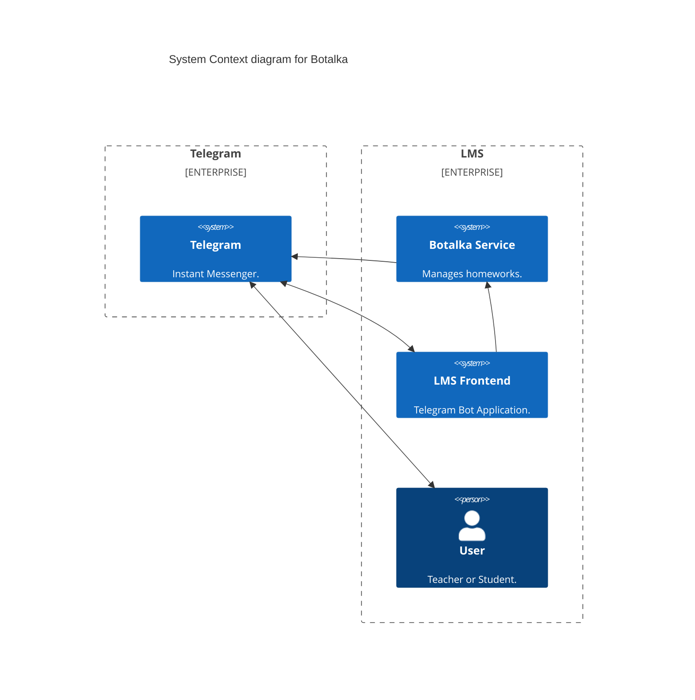
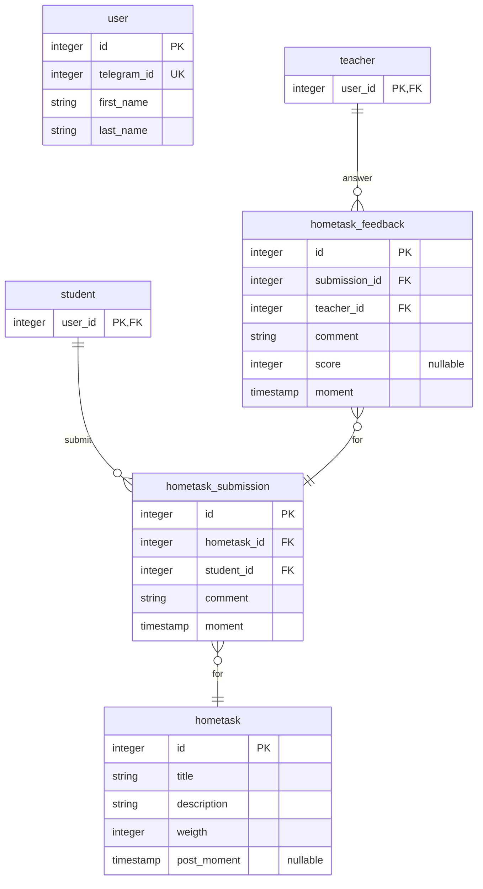

# Design Document of 'botalka' service

## Overall Description

Service manages hometask statements and submissions. It provides a way to
create a hometask event post and schedule it to be published at specified
time. Also it supports gradual hometask development for teacher by working
with drafts. It stores each hometask description and attached files. After
publication it recieves submissions and drives an interaction between teacher
and student.

I propose to have a Telegram Bot UI.

## Functional Requirements

**FR1**. Teacher must be able to create a hometask statement draft.

**FR2**. Hometask statement must contain a title, text description and
         deadline.

**FR3**. Hometask statement can have attached pdf files.

**FR4**. Hometask publication can be scheduled to a given time moment.

**FR5**. Service must store scheduled hometasks as well as drafts.

**FR6**. Service must send a notification when hometask is published.

**FR7**. Hometask statement must be readonly after publication for simplicity.

**FR8**. Student must be able to add submissions for the homework with
         text and attachments such as pdf document.

**FR9**. Teacher must be able to view submissions.

**FR10**. Teacher must be able to send a submission text feedback.

**FR11**. Service must send a notification to teacher when submission is sent.

**FR12**. Service must send a notification to student when feedback is sent.

**FR13**. Student must not be able to send submission after homework deadline.

**FR14**. Student must not be able to send submission after acceptance.

## Deployment Diagram



## Entity Relationship Diagram



## HTTP API

```kotlin
interface Botalka.Api.Http {
  data class Homework.Result(Student.Id, List<Teacher.Id>, Homework.Grade)

  fun `POST  /homework`(Homework.Draft): Homework
  fun `PATCH /homework`(Homework.Draft): Homework
  fun `POST  /homework/{}/submission`(Submission.Draft): Submission
  fun `POST  /homework/{}/submission/{}/feedback`(Feedback.Draft): Feedback
  fun `GET   /homework/{}/result`(): List[Workspace.Result]
}
```

## Produced Events

```kotlin
interface Botalka.Event {
  data class HomeworkPosted(Homework)
  data class SubmissionAdded(Submission)
  data class FeedbackAdded(Feedback)
}
```
